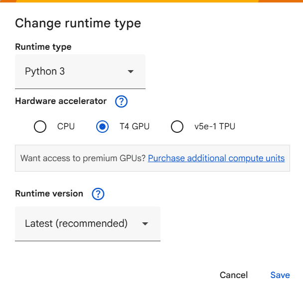
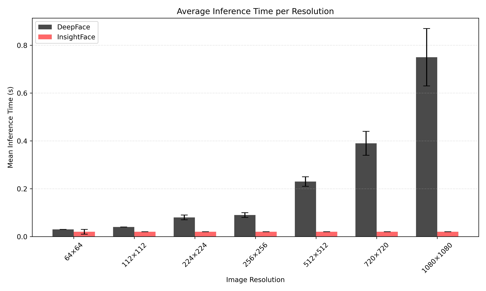
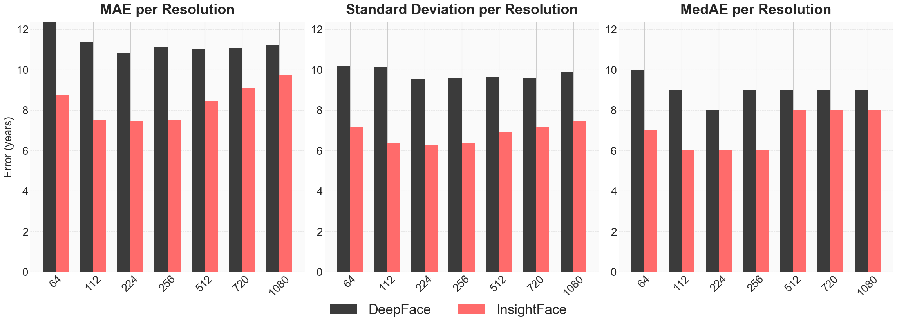

# Impact of Image Resolution on Age Estimation with DeepFace and InsightFace

DeepFace vs. InsightFace

This repository contains the materials related to a study on how input image resolution affects the accuracy and processing performance of age estimation using DeepFace and InsightFace. The project explores seven different resolutions applied to 1000 images from the IMDB-Clean dataset, resulting in 7000 processed samples.

---

## Overview

Automatic age estimation is used in applications such as age verification, access control and automated checkout systems. Input images in these scenarios vary greatly in quality and resolution. This study evaluates how different input resolutions influence the accuracy of two widely used frameworks and whether external resolution still matters despite internal resizing.

This study compares:
- **DeepFace (VGG-Face)**
- **InsightFace (ArcFace + genderage head)**
- **Seven resolutions** from **64×64** up to **1080×1080**
- **7000 total processed samples**
---

## Key Findings

- Both DeepFace and InsightFace achieve their best performance at **224×224 pixels**.
- At 224×224, the results were:
  - **DeepFace:** MAE 10.83 years  
  - **InsightFace:** MAE 7.46 years
- Low resolutions (e.g., 64×64) lead to substantially higher errors.
- Very high resolutions (e.g., 1080×1080) also reduce accuracy.
- InsightFace is significantly faster than DeepFace at all resolutions, typically between **0.015–0.02 seconds per image**.

---

## Repository Contents

| File | Description |
|------|-------------|
| [paper.pdf](./paper.pdf) | English version of the research paper |
| [poster.pdf](./Poster.pdf) | Visual research poster |
| [paper-nl.pdf](./paper-nl.pdf) | Dutch version of the research paper |
| [Colab Notebook](./DeepFace_InsightFace_ResolutionAnalysis.ipynb) | Code used for preprocessing, testing and analysis |
Wil je dat ik deze ook in de Nederlandse README of Engelse README integreer?


---

## Google Colab Notebook

The complete experimental pipeline, including preprocessing, inference and metric calculations, is available in this Colab notebook:

https://colab.research.google.com/drive/1roSZ2Y4Ne9Yy71DM2mRmY0VetfuydbEi

---

## Method Summary

- **Dataset:** IMDB-Clean (1000 selected images)
- **Resolutions tested:** 64×64, 112×112, 224×224, 256×256, 512×512, 720×720, 1080×1080
- **Frameworks:** DeepFace (VGG-Face), InsightFace (ArcFace + genderage head)
- **Metrics:** MAE, Standard Deviation, Median Absolute Error
- **Hardware:** Google Colab T4 GPU

---

## Conclusion

Input image resolution has a clear and consistent effect on age estimation accuracy. Both frameworks perform best at **224×224 pixels**, and InsightFace achieves higher accuracy and faster inference overall. For real-time applications, InsightFace at 224×224 is recommended.

---

## 📜 Citation

If you use this repository, data, or results in your research, please cite the following paper:

**BibTeX:**
```bibtex
@article{jamo2025resolutionageestimation,
  title   = {Impact of Image Resolution on Age Estimation with DeepFace and InsightFace},
  author  = {Jamo, Shiyar},
  journal = {arXiv preprint arXiv:2511.14689},
  year    = {2025}
}
```
📄 **Paper:**
 [https://arxiv.org/abs/2511.14689](https://arxiv.org/abs/2511.14689)
 
🔗 **View PDF:**  
[https://arxiv.org/pdf/2511.14689](https://arxiv.org/pdf/2511.14689)

🔗 **View HTML:**  
[https://arxiv.org/html/2511.14689v1](https://arxiv.org/html/2511.14689v1)


## Author
Shiyar Jamo
Master Applied Artificial Intelligence  
Amsterdam University of Applied Sciences


# Effect van Beeldresolutie op AI-Leeftijdsschatting  
DeepFace vs. InsightFace

Dit repository bevat alle materialen van het onderzoek naar de invloed van invoerresolutie op de nauwkeurigheid en prestaties van leeftijdsschatting met DeepFace en InsightFace. In totaal zijn 1000 afbeeldingen uit de IMDB-Clean dataset verwerkt naar zeven verschillende resoluties, goed voor 7000 testafbeeldingen.

---

## Overzicht

Automatische leeftijdsschatting wordt gebruikt in onder meer leeftijdsverificatie, toegangscontrole en zelfscansystemen. In deze toepassingen varieert de kwaliteit en resolutie van invoerafbeeldingen sterk. Dit onderzoek analyseert hoe verschillende resoluties de uiteindelijke nauwkeurigheid beïnvloeden, ondanks de interne resizing-stappen van beide frameworks.

---

## Belangrijkste Bevindingen

- Beide frameworks behalen de beste resultaten bij **224×224 pixels**.
- Bij 224×224 waren de resultaten:
  - **DeepFace:** MAE 10.83 jaar  
  - **InsightFace:** MAE 7.46 jaar
- Lage resoluties (zoals 64×64) leiden tot hogere fouten.
- Zeer hoge resoluties (zoals 1080×1080) verlagen de nauwkeurigheid opnieuw.
- InsightFace is in alle resoluties duidelijk sneller, met verwerkingstijden rond **0.015–0.02 seconden per afbeelding**.

---

## Inhoud van het Repository

| Bestand | Beschrijving |
|---------|--------------|
| [paper.pdf](./paper.pdf) | Engelstalige onderzoeksversie |
| [Poster.pdf](./poster.pdf) | Visuele onderzoeksposter |
| [paper-nl.pdf](./paper-nl.pdf) | Nederlandstalige onderzoeksversie |

---

## Google Colab Notebook

De volledige code en experimentele workflow zijn beschikbaar in deze Colab-notebook:

https://colab.research.google.com/drive/1roSZ2Y4Ne9Yy71DM2mRmY0VetfuydbEi

---

## Samenvatting van de Methode

- **Dataset:** IMDB-Clean (1000 geselecteerde afbeeldingen)
- **Geteste resoluties:** 64×64 t/m 1080×1080
- **Frameworks:** DeepFace (VGG-Face), InsightFace (ArcFace + genderage head)
- **Evaluatiemetrics:** MAE, standaarddeviatie, median absolute error
- **Omgeving:** Google Colab T4 GPU

---

## Conclusie

De invoerresolutie heeft een duidelijke en consistente invloed op de nauwkeurigheid van leeftijdsschatting. De beste prestaties worden behaald bij **224×224 pixels**. InsightFace levert zowel nauwkeurigere resultaten als snellere verwerkingstijden en is daarmee geschikt voor real-time toepassingen.

---

## Auteur

Shiyar Jamo  
Master Applied Artificial Intelligence  
Hogeschool van Amsterdam


## Figures

### Figure 1 — Google Colab Environment Setup
<p align="center">
  
</p>

This figure shows the runtime configuration used for all experiments.  
A **T4 GPU** was selected in Google Colab to ensure consistent hardware performance across all tests.  
Both DeepFace and InsightFace were executed using Python 3 with the latest stable runtime version.

---

### Figure 2 — Average Inference Time per Resolution
<p align="center">
  
</p>

This figure illustrates the mean inference time of DeepFace and InsightFace across seven input resolutions, from **64×64** to **1080×1080** pixels.  
- InsightFace remains consistently fast (≈0.015–0.02 s).  
- DeepFace shows a strong increase in processing time as resolution grows, reaching **0.7 s** at 1080×1080.  
These results highlight the greater computational efficiency of InsightFace.

---

### Figure 3 — Error Metrics per Resolution (MAE, SD, MedAE)
<p align="center">
  
</p>

This composite figure presents three key error metrics per resolution:
- **MAE (Mean Absolute Error)**
- **Standard Deviation**
- **Median Absolute Error**

InsightFace consistently outperforms DeepFace across all metrics, with the lowest errors occurring at **224×224 pixels**.  
Both very low and very high resolutions lead to degraded performance.

## Repository
https://github.com/codershiyar/image-resolution-effect-on-ai

